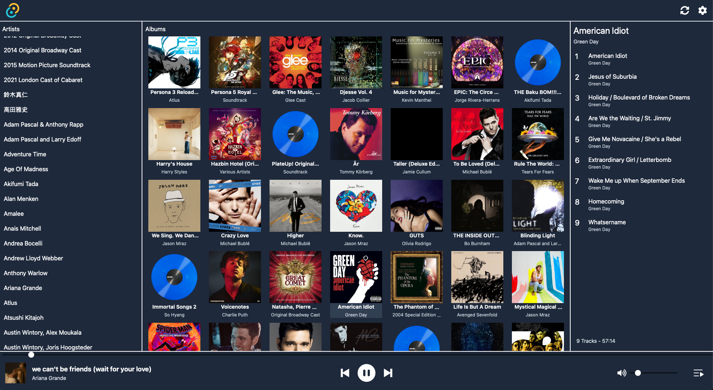

# Music Player

## Summary
"Music Player" is a desktop music player that is built to support playback from Subsonic-compatible servers, as well as a user's local music directories (local music functionality is still a WIP).

## Tech Stack

This project uses the 2.0 version of Tauri (currently in beta), and on the front-end utilizes modern React libraries such as Tanstack Query and Tanstack Router. The UI is based around Shadcn + Tailwind-friendly components, with minor manual CSS adjustments to account for more complex layouts (e.g. album grid).

In its current iteration, the Rust-specific implementation is fairly simple; it is primarily used to verify the initial Subosnic server connection (in which the md5 + salt needed for API authentication is generated). In the future, the Rust modules will mainly contain functionality related to mass file system operations (e.g. arranging local music metadata into the existing Subsonic models).

## Current Features
* Ability to connect to a single Subsonic server
* Basic Subsonic library navigation (artist, album, and song selection)
* Basic playback functionality using the "stream" Subsonic API call
* Album art retrieval + local caching of album art
* Simple Light/Dark mode

## WIP (and Future Features)
* Auto-Sync of libraries
* Support for multiple Subsonic libraries
* Support for local file libraries
* Download server tracks for offline functionality
* UI polish + improvements
* Metadata + Album Art updates (if supported by the API)
